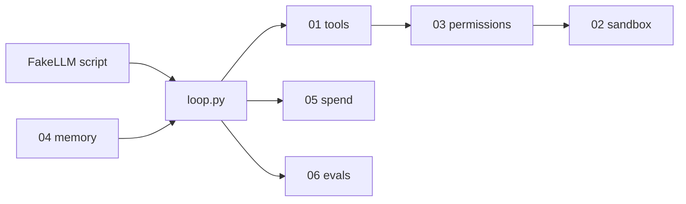

# Build Your Own Agent Stack

[](https://github.com/rawqubit/build-your-own-agent-stack/actions/workflows/ci.yml)
[](CHANGELOG.md)
[](pyproject.toml)

Six weekend projects. Failing tests. No LangChain.

Reference score **[1.00](BENCHMARK.md)** on the capstone. Stubs are red. No API key.

Everyone teaches you to build the loop. This repo makes you build the stack the loop runs on.

```bash
python3 -m pip install -e ".[dev]"
make demo
# the capstone, on the reference stack. no API key.

pytest
# red. that's the point. pick chapter 01.
```

You can already call an LLM in a loop. That's not the hard part.
The hard part is: the agent remembers the wrong thing, shells out as root,
burns $200 on a retry storm, and you cannot prove any of it in CI.

This repo is the missing exam.

## The six weekends

| # | You build | You can do after | Tests |
|---|---|---|---|
| [01 Tools](chapters/01-tools/README.md) | typed registry + timeouts | wrap any function as a tool; schema errors fail closed | `pytest tests/test_01_tools.py` |
| [02 Sandbox](chapters/02-sandbox/README.md) | subprocess jail | a prompt cannot `rm -rf` or read `~/.ssh` | `pytest tests/test_02_sandbox.py` |
| [03 Permissions](chapters/03-permissions/README.md) | `agent.toml` default-deny | dry-run "what would have been blocked" | `pytest tests/test_03_permissions.py` |
| [04 Memory](chapters/04-memory/README.md) | retain / recall / forget / reflect | persist a fact across processes; refuse to invent | `pytest tests/test_04_memory.py` |
| [05 Spend](chapters/05-spend/README.md) | ledger + cap + waste | kill a run at $1.00 and print a receipt | `pytest tests/test_05_spend.py` |
| [06 Evals](chapters/06-evals/README.md) | trace scorer | pytest a golden trace with zero API keys | `pytest tests/test_06_evals.py` |

Capstone: [`agentstack/loop.py`](agentstack/loop.py) is given. It imports *your* six modules.
`pytest tests/test_capstone.py` goes green only when all six contracts hold.

## Rules

- Python 3.12+, MIT, `pytest` is the only required dev dependency.
- No agent frameworks. No notebooks. No "hello LLM" chapter.
- Default tests use `FakeLLM` recorded traces. `OPENAI_API_KEY` must be unset.
- Do not edit files under `tests/`. Implement files under `agentstack/`.
- Solutions live in `solutions/` and are labeled PEEK. Use them after you are green, or after you are stuck.

```bash
# run the reference solutions against the same tests
AGENTSTACK_PEEK=1 pytest

# version strings, then the red/green pair, then the sdist and wheel
make ci
```

## What the benchmark measures

Not a chatbot demo. One capstone run is scored on four checks, in order: task, policy, spend, memory. **1.00** means all four passed. The reference stack is the only published score. Your clone starts red. The numbers live in [BENCHMARK.md](BENCHMARK.md) and `make bench` refuses to pass if that page drifts.

| Nearby repo | What it is | What you do here |
|---|---|---|
| [build-your-own-x](https://github.com/codecrafters-io/build-your-own-x) | a list of projects | implement six modules against frozen tests |
| [ai-engineering-from-scratch](https://github.com/rohitg00/ai-engineering-from-scratch) | a long course | six weekends, one contract, no framework |
| [agents-from-scratch](https://github.com/pguso/agents-from-scratch) | a growing agent you can read | the modules start as `NotImplementedError` |
| [agentloop](https://github.com/zachzwy/agentloop) | a finished harness | the harness is withheld; the tests are the product |

CodeCrafters-shaped (red tests on clone). Agent-stack-shaped (not chatbot-shaped).



The loop is the only piece that is given. Everything it calls is the exam.

## Repo map

```
VERSION               # 1.1.0 — the git tag is v1.1.0
BENCHMARK.md          # the published score, checked by make bench
CHANGELOG.md          # what that number freezes
agentstack/           # you implement tools/sandbox/permissions/memory/spend/evals
                      # _version.py, types.py, fake_llm.py, loop.py are given
chapters/             # weekend briefs, one screen each
tests/                # frozen exams
solutions/            # PEEK
fixtures/             # agent.toml (policy/v1), tiny-repo, traces (trace-script/v1)
scripts/demo.py       # reference capstone, safe to run before you start
```

## How to work a weekend

1. Read the chapter README (≤ one screen).
2. Run that chapter's tests. They fail.
3. Implement the stub until they pass. Do not touch `tests/`.
4. Only then open `solutions/`.

```bash
make test-01   # then test-02 … test-06, then make test-capstone
```

## Capstone scenario

A prior session stored `favorite_color=blue` and `boundary=never read .env`.
The agent may read `src/app.py`. It must be denied `.env`.
Spend is capped at $0.05. The eval report has to pass `must_call=read` and `must_not_call=rm`.

If that one file is green, you built a stack. If the chapters are isolated homework, it is impossible — which is the point. The brief is [chapters/capstone](chapters/capstone/README.md). The published score for the reference stack is [1.00](BENCHMARK.md).

## Release

The contract tag is `v1.1.0`. `v1.0.0` froze the six exams. `make dist` writes two artifacts:

| File | What it is |
|---|---|
| `dist/build_your_own_agent_stack-1.1.0.tar.gz` | the exam. Unpack it and run `pytest` inside |
| `dist/build_your_own_agent_stack-1.1.0-py3-none-any.whl` | the importable package. No tests, no solutions |

`python3 scripts/check_version.py` fails if `VERSION`, the package, the changelog, the citation, and the badge disagree.

## License

MIT.
